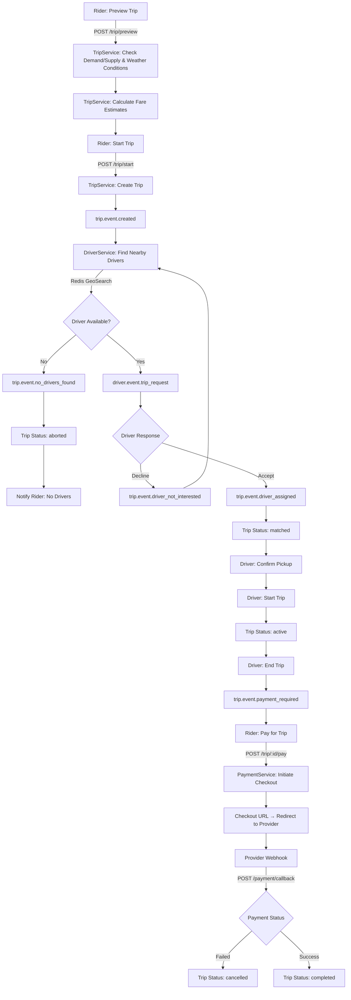

# Wayfare

Wayfare is a ride-hailing microservices application built with Go. It enables riders to book trips, get dynamic fare estimates, and pay seamlessly; while drivers can accept trips, track earnings, and receive payouts.

## Features

- **Real-Time Communication**: WebSocket connections for drivers and riders to exchange chat messages, location updates, and trip state changes.
- **Trip Management**: Preview trips with dynamic fare estimates across multiple car packages, start trips and view trip history.
- **Dynamic Ride Fare**: Fare calculation using OSRM routing (distance/duration), OpenWeatherMap weather data for surge pricing, and demand/supply analysis within a geographic region.
- **Driver Assignment**: Nearest available drivers found via Redis GeoSearch, with fallback to the next closest driver when a driver declines or is unavailable.
- **Payment Processing**: Checkout via Paystack with automatic fallback to Flutterwave. Supports ride fare payments, driver payouts and returns.
- **Driver Earnings & Payouts**: Daily automated driver payouts with retry logic, tier-based driver profiles and balance tracking.
- **Observability & Monitoring**: OpenTelemetry tracing exported to Jaeger, Prometheus metrics with a pre-configured exporter, and structured logging with request latency tracking.
- **Analytics**: Trip lifecycle events stored in ClickHouse for analytics and reporting, partitioned by month.

## Next Steps?

- **Driver Verification**: Automated verification of driver documents and vehicle information.
- **In-App Wallet**: Rider wallet with top-up and auto-debit for faster post-trip payments.

## Prerequisites

- Go 1.25+
- Docker & Docker Desktop
- Protocol Buffer Compiler (`protoc`)
- `protoc-gen-go` and `protoc-gen-go-grpc` plugins
- GNU Make

## Tech Stack

- **Language**: Go
- **HTTP Framework**: Gin
- **Inter-Service Communication**: gRPC
- **Databases**: MongoDB (primary), ClickHouse (analytics)
- **Caching & Geo**: Redis
- **Messaging**: RabbitMQ (AMQP)
- **File Storage**: Cloudinary
- **Payment Processors**: Paystack (primary) & Flutterwave (fallback)
- **Routing Engine**: OSRM API
- **Weather Data**: OpenWeatherMap API
- **Observability**: OpenTelemetry, Jaeger & Prometheus

## Getting Started

Clone this repository and follow the instructions to set up the project locally:

### 1. Installation

- Run `go mod download` to install all project dependencies.

### 2. Environment Variables

- Create a `.env` file in the project root using the required variables in [`.env.example`](.env.example)

### 3. Compile Protobuf

- Generate Go code from proto definitions: `make compile-proto`
- The generated code will be placed in `shared/pkg/`.

### 4. Run the Services

- All services run inside Docker by default. Use `docker compose up -d --build` to start the full stack (infra + services).
  > Remove the `--build` flag when not making any changes to the services.

- When all services are running, the API gateway will be available at: `http://localhost:8080`
- After making updates to a service, rebuild and restart using: `docker compose up -d --no-deps --build <service-name>` (e.g., `docker compose up -d --no-deps --build api-gateway`)
- To stop all services, use: `docker compose down` (To remove data volumes, use `docker compose down -v`)

### 5. Seed Database

- The database must be seeded with `regions` and `pricing` documents for trip previews to work.
- These may be imported as JSON documents into MongoDB using the MongoDB Compass GUI.

### 6. Monitoring

- **Jaeger UI**: View distributed traces at `http://localhost:16686`
- **Prometheus**: View application metrics at `http://localhost:9090`
- **RabbitMQ Management**: Monitor queues at `http://localhost:15672`

## Endpoints

All endpoints are prefixed with `/api/v1` except system and websocket endpoints.

### System

| Method | Path | Auth | Description |
|--------|------|------|-------------|
| GET    | `/livez` | None | Liveness check |
| GET    | `/api/v1/metrics` | None | Prometheus metrics endpoint |

### Auth API

| Method | Path | Auth | Description |
|--------|------|------|-------------|
| POST | `/auth/signup` | None | Sign up a rider or driver (role via `X-User-Role` header) |
| POST | `/auth/login` | None | Sign in a rider or driver |
| POST | `/auth/refresh` | None | Refresh access token |
| POST | `/auth/logout` | JWT | Sign out a rider or driver |

### User API

| Method | Path | Auth | Description |
|--------|------|------|-------------|
| GET | `/user/profile` | JWT | Get rider or driver profile |

### Trip API

| Method | Path | Auth | Description |
|--------|------|------|-------------|
| POST | `/trip/preview` | JWT | Preview trip with fare estimates for available car packages |
| POST | `/trip/start` | JWT | Start a trip and begin driver search |
| POST | `/trip/:id/pay` | JWT | Pay for a completed trip |
| GET | `/trip/:id/chat` | JWT | Get trip chat history |
| GET | `/trip/history` | JWT | Get user trip history |

### Driver API

| Method | Path | Auth | Description |
|--------|------|------|-------------|
| POST | `/driver/returns/pay` | JWT | Pay outstanding returns owed by a driver |

### Payment API

| Method | Path | Auth | Description |
|--------|------|------|-------------|
| POST | `/payment/callback` | None | Payment webhook callback (Paystack/Flutterwave) |

### WebSocket

| Method | Path | Auth | Description |
|--------|------|------|-------------|
| GET | `/ws/drivers` | None | WebSocket connection for driver clients |
| GET | `/ws/riders` | None | WebSocket connection for rider clients |

## Trip Lifecycle

## Payment Processing

- **Ride Fare**: Riders pay for completed trips via Paystack (with automatic Flutterwave fallback). The checkout URL is returned to the client for redirect.
- **Driver Payouts**: Three scheduled cron jobs process pending driver payouts(initial attempt, with two retries to handle unsettled/failed transactions).
- **Returns**: Drivers can have outstanding returns (when riders pay with cash). These can be paid back via the `/driver/returns/pay` endpoint.

Happy riding! :car:
